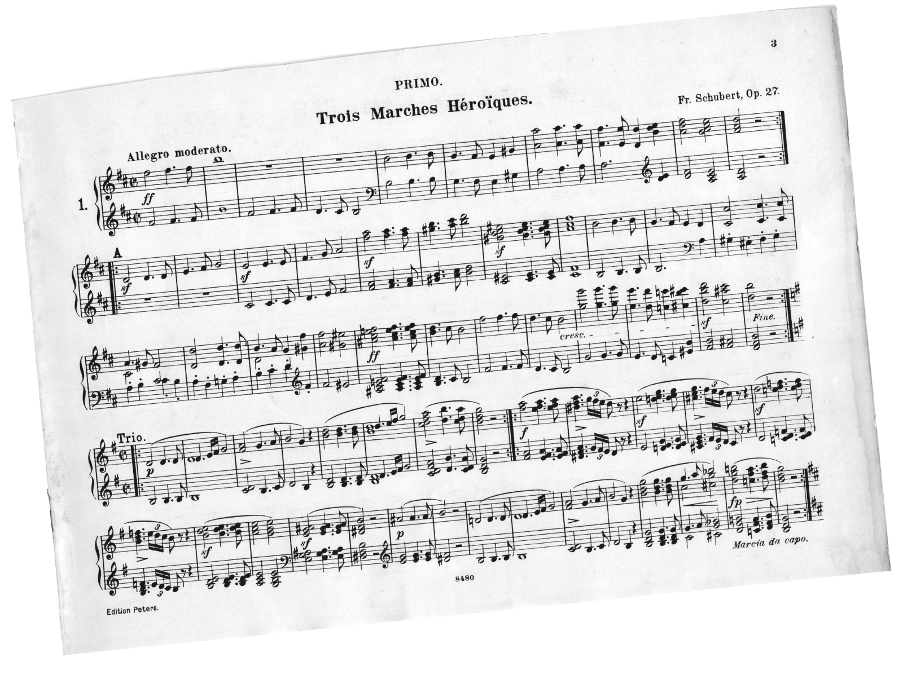
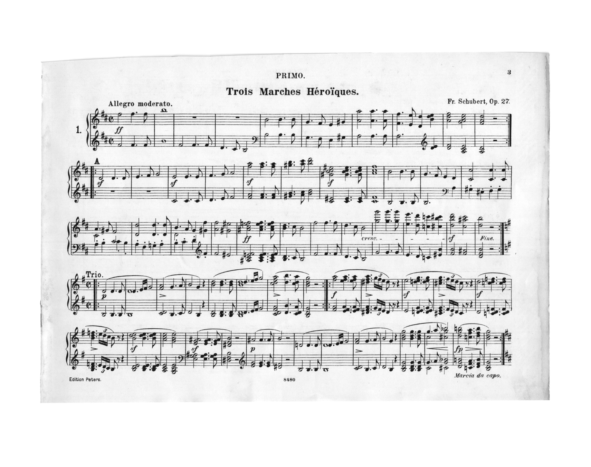
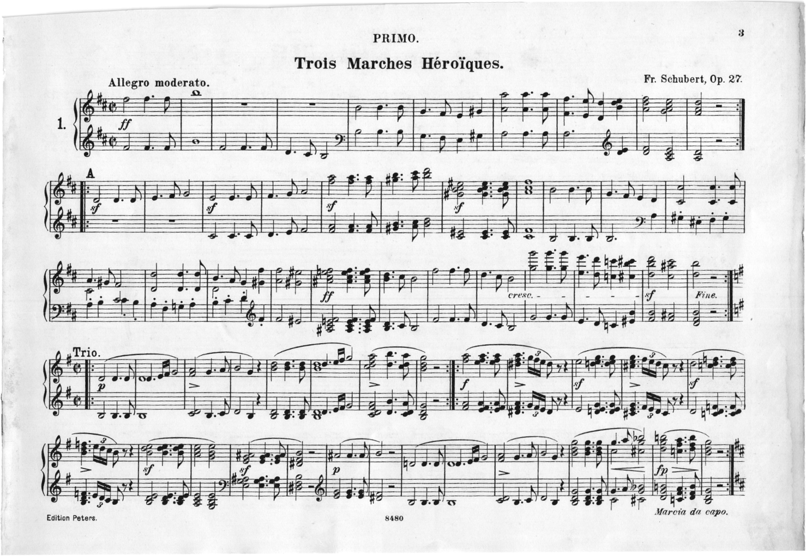
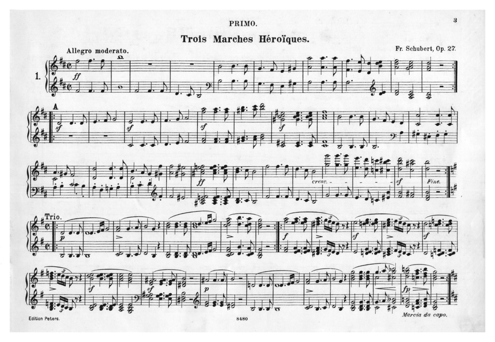
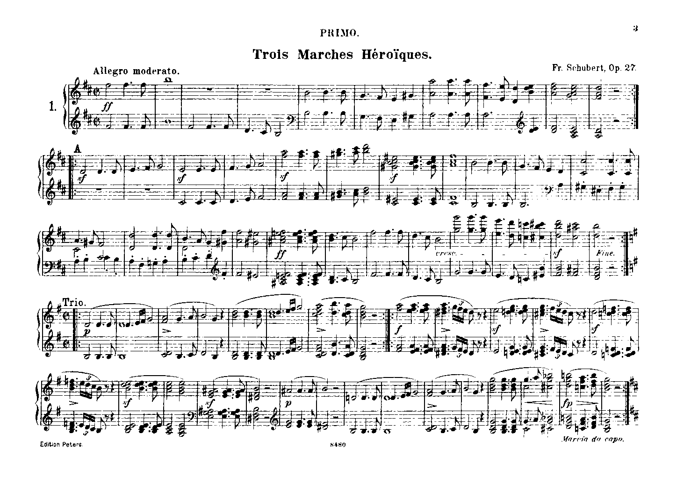

[](https://travis-ci.org/JosefFriedrich-shell/imagemagick-imslp.sh)

# imagemagick-imslp.sh


## Summary / Short description

> A wrapper script for imagemagick to process image files suitable for imslp.org (International Music Score Library Project)

## Usage

```
Usage: imagemagick-imslp.sh [-bcfhjrSstv] <filename-or-glob-pattern>

A wrapper script for imagemagick to process image files suitable for imslp.org (International Music Score Library Project)

http://imslp.org/wiki/IMSLP:Musiknoten_beisteuern

OPTIONS:
	-b, --backup
	  Backup original images (add .bak to filename).
	-c, --compression
	  Use CCITT Group 4 compression. This options generates a PDF
	  file.
	-f, --force
	  force
	-h, --help
	  Show this help message
	-j, --join
	  Join single paged PDF files to one PDF file
	-r, --resize
	  Resize 200%
	-S, --threshold-series
	  Convert the samge image with differnt threshold values to find
	  the best threshold value. Those values are probed:
	  .
	-s, --short-description
	  Show a short description / summary.
	-t, --threshold
	  threshold, default 50%.
	-v, --version
	  Show the version number of this script.

```

## Project pages

* https://github.com/JosefFriedrich-shell/imagemagick-imslp.sh

## Testing

```
make test
```

## Example

Original file size: 1.1 MB



```sh
magick convert original.png -deskew 40% deskew.png
```



```sh
magick convert deskew.png -trim +repage repage.png
```



```sh
magick convert repage.png \
  -region 1449x29 -level 0%,30% \
  -region 29x992+1449 -level 0%,30% \
  -region 1449x29+29+992 -level 0%,30% \
  -region 29x992+0+29 -level 0%,30% \
  border-lighten.png
```


```sh
magick convert border-lighten.png -resize 200% resize.png
```



```sh
magick convert resize.png -threshold 70% threshold.png
```



```sh
magick convert threshold.png -trim +repage repage2.png
```


magick convert repage2.png -compress Group4 -monochrome compress.pdf


Final file size: 52 KB
